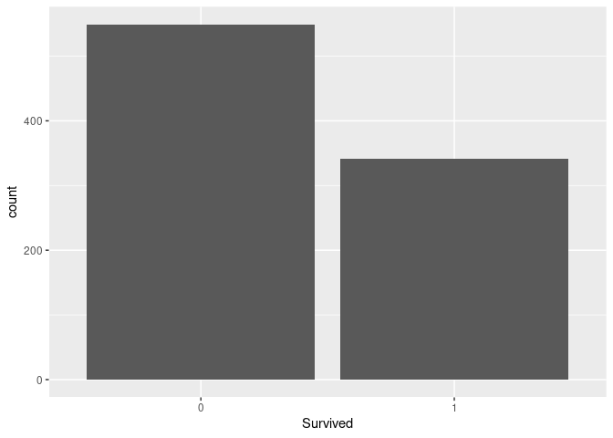
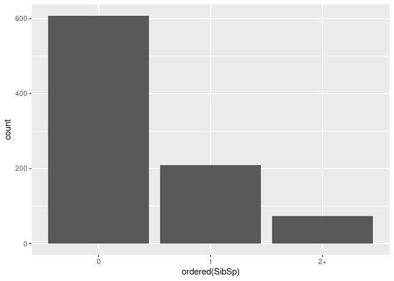
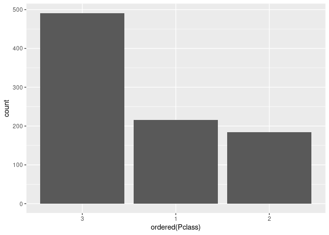
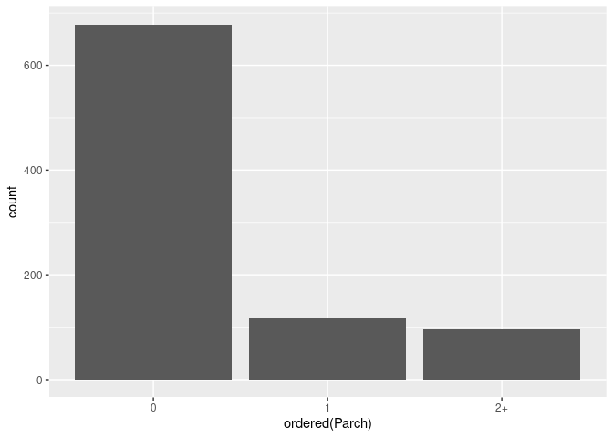
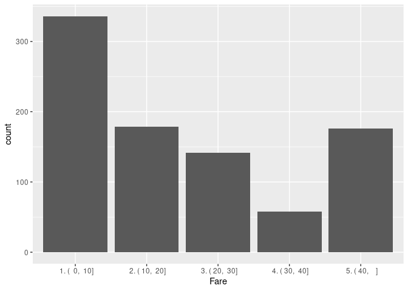
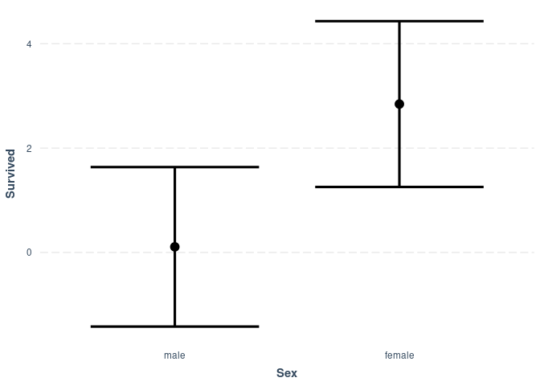
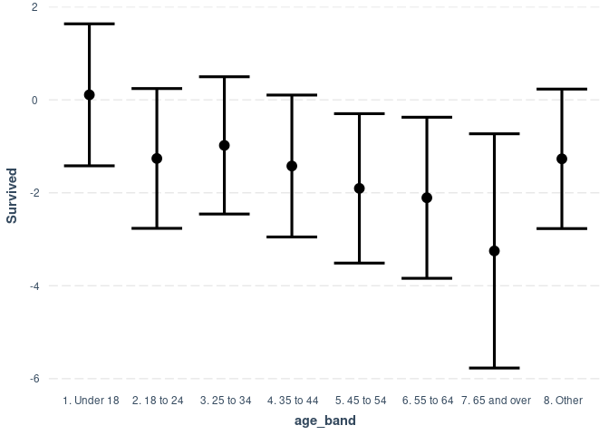
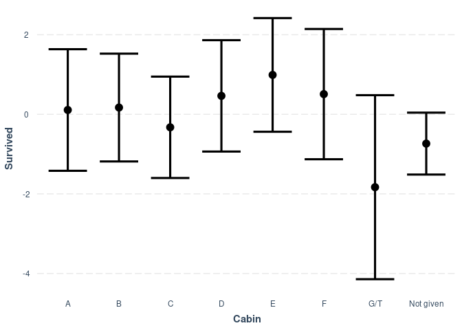
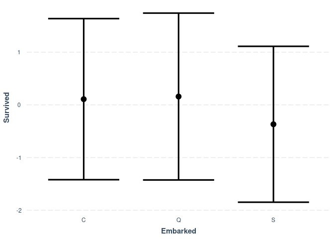
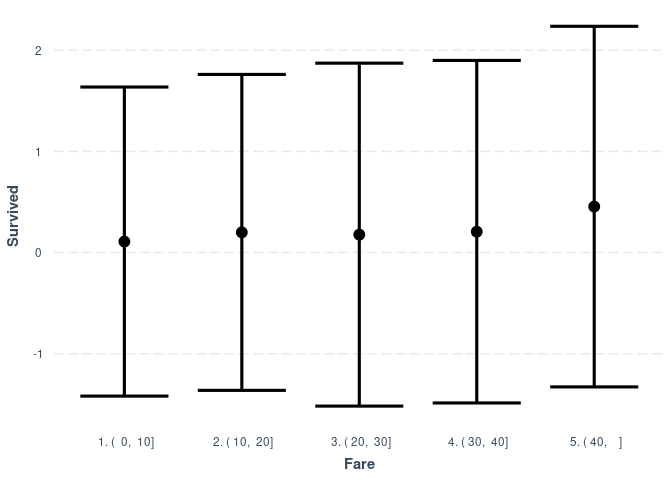

Here we are going to fit a classical logistic regression to the Kaggle 
[_Titanic_ data set](https://www.kaggle.com/hesh97/titanicdataset-traincsv).


```r
lib_vec <- c('readr', 'magrittr', 'ggplot2', 'dplyr', 'jtools')
for (lib in lib_vec){
  library(lib, character.only=TRUE)
}
```

```
## 
## Attaching package: 'dplyr'
```

```
## The following objects are masked from 'package:stats':
## 
##     filter, lag
```

```
## The following objects are masked from 'package:base':
## 
##     intersect, setdiff, setequal, union
```

Read in the _Titanic_ data set which I have already downloaded to a local 
location in CSV format.


```r
titanic_filename <- "titanic-train.csv"
data_path = "~/repos/titanic/data"
titanic_df <- read_csv(file.path(data_path, titanic_filename), 
                       col_types="iffcfnincncc") %>%
  mutate(age_band = factor(case_when(
    Age < 18 ~ " 1. Under 18",
    Age < 25 ~ " 2. 18 to 24",
    Age < 35 ~ " 3. 25 to 34",
    Age < 45 ~ " 4. 35 to 44",
    Age < 55 ~ " 5. 45 to 54",
    Age < 65 ~ " 6. 55 to 64",
    Age >= 65 ~ " 7. 65 and over",
    TRUE ~ " 8. Other")),
    SibSp = factor(
      case_when(
        SibSp >= 2 ~ "2+",
        TRUE ~ as.character(SibSp)
      )
    ),
    Parch = factor(
      case_when(
        Parch >= 2 ~ "2+",
        TRUE ~ as.character(Parch)
      )
    ), # placeholder
    Cabin = substring(Cabin, 1, 1),
    Cabin = factor(case_when(
      Cabin %in% c('G', 'T') ~ "G/T",
      is.na(Cabin) ~ "Not given",
      TRUE ~ Cabin
    )),
    Fare = factor(case_when(
      Fare <= 10  ~ " 1. (  0,  10]",
      Fare <= 20  ~ " 2. ( 10,  20]",
      Fare <= 30  ~ " 3. ( 20,  30]",
      Fare <= 40  ~ " 4. ( 30,  40]",
      TRUE  ~ " 5. ( 40,    ]",
   )),
   Embarked = factor(
     case_when(
       is.na(Embarked) ~ 'S',
       TRUE ~ Embarked
     )
   )
    )
titanic_df %>% head(20)
```

```
## # A tibble: 20 x 13
##    PassengerId Survived Pclass Name   Sex     Age SibSp Parch Ticket Fare  Cabin
##          <int> <fct>    <fct>  <chr>  <fct> <dbl> <fct> <fct> <chr>  <fct> <fct>
##  1           1 0        3      Braun… male     22 1     0     A/5 2… " 1.… Not …
##  2           2 1        1      Cumin… fema…    38 1     0     PC 17… " 5.… C    
##  3           3 1        3      Heikk… fema…    26 0     0     STON/… " 1.… Not …
##  4           4 1        1      Futre… fema…    35 1     0     113803 " 5.… C    
##  5           5 0        3      Allen… male     35 0     0     373450 " 1.… Not …
##  6           6 0        3      Moran… male     NA 0     0     330877 " 1.… Not …
##  7           7 0        1      McCar… male     54 0     0     17463  " 5.… E    
##  8           8 0        3      Palss… male      2 2+    1     349909 " 3.… Not …
##  9           9 1        3      Johns… fema…    27 0     2+    347742 " 2.… Not …
## 10          10 1        2      Nasse… fema…    14 1     0     237736 " 4.… Not …
## 11          11 1        3      Sands… fema…     4 1     1     PP 95… " 2.… G/T  
## 12          12 1        1      Bonne… fema…    58 0     0     113783 " 3.… C    
## 13          13 0        3      Saund… male     20 0     0     A/5. … " 1.… Not …
## 14          14 0        3      Ander… male     39 1     2+    347082 " 4.… Not …
## 15          15 0        3      Vestr… fema…    14 0     0     350406 " 1.… Not …
## 16          16 1        2      Hewle… fema…    55 0     0     248706 " 2.… Not …
## 17          17 0        3      Rice,… male      2 2+    1     382652 " 3.… Not …
## 18          18 1        2      Willi… male     NA 0     0     244373 " 2.… Not …
## 19          19 0        3      Vande… fema…    31 1     0     345763 " 2.… Not …
## 20          20 1        3      Masse… fema…    NA 0     0     2649   " 1.… Not …
## # … with 2 more variables: Embarked <fct>, age_band <fct>
```
Now we are going to examine some of this data. The thing we are trying to 
predict--the _target_--is `Survived`; that is, whether the passenger survived
(`1`) or did not (`0`).


```r
ggplot(data=titanic_df, aes(x=Survived)) + geom_bar()
```

<!-- -->
`SibSp` is the number of siblings or spouse on board.


```r
ggplot(data=titanic_df, aes(x=ordered(SibSp))) + geom_bar()
```

<!-- -->

`Pclass` is the passenger class.


```r
ggplot(data=titanic_df, aes(x=ordered(Pclass))) + geom_bar()
```

<!-- -->

`Parch` is the number of parents/children onboard the _Titanic_.

```r
ggplot(data=titanic_df, aes(x=ordered(Parch))) + geom_bar()
```

<!-- -->
Let's visualise `Fare`.

```r
ggplot(data=titanic_df, aes(x=Fare)) + geom_bar()
```

<!-- -->

## Fit a GLM


```r
glm_01 <- glm(Survived ~ Pclass + Sex + age_band + SibSp + Parch + Fare + Cabin + Embarked,
              data=titanic_df, family=binomial)
anova(glm_01, test='Chisq')
```

```
## Analysis of Deviance Table
## 
## Model: binomial, link: logit
## 
## Response: Survived
## 
## Terms added sequentially (first to last)
## 
## 
##          Df Deviance Resid. Df Resid. Dev  Pr(>Chi)    
## NULL                       890    1186.66              
## Pclass    2  103.547       888    1083.11 < 2.2e-16 ***
## Sex       1  256.220       887     826.89 < 2.2e-16 ***
## age_band  7   25.640       880     801.25 0.0005840 ***
## SibSp     2   16.694       878     784.55 0.0002371 ***
## Parch     2    3.900       876     780.66 0.1423089    
## Fare      4    1.441       872     779.21 0.8370509    
## Cabin     7   15.682       865     763.53 0.0281830 *  
## Embarked  2    5.009       863     758.52 0.0817326 .  
## ---
## Signif. codes:  0 '***' 0.001 '**' 0.01 '*' 0.05 '.' 0.1 ' ' 1
```

```r
summary(glm_01)
```

```
## 
## Call:
## glm(formula = Survived ~ Pclass + Sex + age_band + SibSp + Parch + 
##     Fare + Cabin + Embarked, family = binomial, data = titanic_df)
## 
## Deviance Residuals: 
##     Min       1Q   Median       3Q      Max  
## -2.5514  -0.6254  -0.3818   0.5720   2.5841  
## 
## Coefficients:
##                         Estimate Std. Error z value Pr(>|z|)    
## (Intercept)              0.10832    0.77843   0.139 0.889334    
## Pclass1                  1.39381    0.52904   2.635 0.008424 ** 
## Pclass2                  1.05813    0.30546   3.464 0.000532 ***
## Sexfemale                2.73557    0.21185  12.913  < 2e-16 ***
## age_band 2. 18 to 24    -1.36944    0.37236  -3.678 0.000235 ***
## age_band 3. 25 to 34    -1.08831    0.35717  -3.047 0.002311 ** 
## age_band 4. 35 to 44    -1.53207    0.39933  -3.837 0.000125 ***
## age_band 5. 45 to 54    -2.01319    0.45186  -4.455 8.38e-06 ***
## age_band 6. 55 to 64    -2.21546    0.60183  -3.681 0.000232 ***
## age_band 7. 65 and over -3.35952    1.15066  -2.920 0.003504 ** 
## age_band 8. Other       -1.37755    0.37881  -3.636 0.000276 ***
## SibSp1                  -0.02670    0.25043  -0.107 0.915082    
## SibSp2+                 -1.30675    0.42860  -3.049 0.002297 ** 
## Parch1                   0.17985    0.31417   0.572 0.567005    
## Parch2+                 -0.42993    0.35948  -1.196 0.231706    
## Fare 2. ( 10,  20]       0.09089    0.32287   0.282 0.778322    
## Fare 3. ( 20,  30]       0.06864    0.39740   0.173 0.862865    
## Fare 4. ( 30,  40]       0.09779    0.49297   0.198 0.842758    
## Fare 5. ( 40,    ]       0.34598    0.50561   0.684 0.493798    
## CabinB                   0.06157    0.71413   0.086 0.931292    
## CabinC                  -0.43524    0.66889  -0.651 0.515244    
## CabinD                   0.35476    0.75164   0.472 0.636945    
## CabinE                   0.88119    0.77044   1.144 0.252730    
## CabinF                   0.39872    1.01748   0.392 0.695157    
## CabinG/T                -1.94008    1.28924  -1.505 0.132368    
## CabinNot given          -0.84486    0.68418  -1.235 0.216887    
## EmbarkedQ                0.04961    0.40881   0.121 0.903410    
## EmbarkedS               -0.47637    0.25177  -1.892 0.058481 .  
## ---
## Signif. codes:  0 '***' 0.001 '**' 0.01 '*' 0.05 '.' 0.1 ' ' 1
## 
## (Dispersion parameter for binomial family taken to be 1)
## 
##     Null deviance: 1186.66  on 890  degrees of freedom
## Residual deviance:  758.52  on 863  degrees of freedom
## AIC: 814.52
## 
## Number of Fisher Scoring iterations: 5
```
The large effects are on the variables `Sex`, `age_band`, `Cabin` and `Embarked`.
We will also examine `Fare` since there seems to be some signal there.

```r
effect_plot(model=glm_01, pred=Sex, interval=TRUE, outcome.scale="link")
```

<!-- -->

```r
effect_plot(model=glm_01, pred=age_band, interval=TRUE, outcome.scale="link")
```

<!-- -->

```r
effect_plot(model=glm_01, pred=Cabin, interval=TRUE, outcome.scale="link")
```

<!-- -->

```r
effect_plot(model=glm_01, pred=Embarked, interval=TRUE, outcome.scale="link")
```

<!-- -->

```r
effect_plot(model=glm_01, pred=Fare, interval=TRUE, outcome.scale="link")
```

<!-- -->
We have a broad idea of the factors involved that improved passengers' 
chances of survival on the ill-fated voyage. Let's look now at a couple of 
observations: one each of a strong prediction for survival and a strong 
prediction of the opposite of survival.


```r
preds_01 <- predict.glm(glm_01, newdata=titanic_df)
preds_01 %>% max
```

```
## [1] 4.825095
```

```r
titanic_max <- preds_01 %>% which.max
titanic_min <- preds_01 %>% which.min
```
First look at the maximum.

```r
titanic_predictors <- c('Pclass', 'Sex', 'age_band', 'SibSp', 'Parch',  
    'Fare', 'Cabin', 'Embarked')
titanic_df[titanic_max, titanic_predictors]
```

```
## # A tibble: 1 x 8
##   Pclass Sex    age_band       SibSp Parch Fare             Cabin Embarked
##   <fct>  <fct>  <fct>          <fct> <fct> <fct>            <fct> <fct>   
## 1 1      female " 1. Under 18" 0     1     " 5. ( 40,    ]" B     C
```

```r
glm_01 %>% coef
```

```
##             (Intercept)                 Pclass1                 Pclass2 
##              0.10831603              1.39380902              1.05812593 
##               Sexfemale    age_band 2. 18 to 24    age_band 3. 25 to 34 
##              2.73556786             -1.36944063             -1.08830597 
##    age_band 4. 35 to 44    age_band 5. 45 to 54    age_band 6. 55 to 64 
##             -1.53207495             -2.01319431             -2.21545788 
## age_band 7. 65 and over       age_band 8. Other                  SibSp1 
##             -3.35951828             -1.37754512             -0.02670373 
##                 SibSp2+                  Parch1                 Parch2+ 
##             -1.30675405              0.17985123             -0.42992730 
##      Fare 2. ( 10,  20]      Fare 3. ( 20,  30]      Fare 4. ( 30,  40] 
##              0.09089064              0.06864218              0.09778882 
##      Fare 5. ( 40,    ]                  CabinB                  CabinC 
##              0.34597961              0.06157172             -0.43524084 
##                  CabinD                  CabinE                  CabinF 
##              0.35475628              0.88118937              0.39871615 
##                CabinG/T          CabinNot given               EmbarkedQ 
##             -1.94008428             -0.84485644              0.04961068 
##               EmbarkedS 
##             -0.47636764
```


```r
0.10831603 + 
  1.39380902 + # Pclass 1
  2.73556786 + # Sex female
  0 + # age_band 1. Under 18
  0 + # SibSp 0
  0.17985123 + # Parch 1
  0.34597961 + # Fare 40+
  0.06157172 + # Cabin B
  0  # Embarked C
```

```
## [1] 4.825095
```

```r
preds_max <- preds_01 %>% max
preds_max
```

```
## [1] 4.825095
```

```r
1/(1 + exp(-preds_max))
```

```
## [1] 0.9920381
```


```r
titanic_predictors <- c('Pclass', 'Sex', 'age_band', 'SibSp', 'Parch',  
    'Fare', 'Cabin', 'Embarked')
titanic_df[titanic_min, titanic_predictors]
```

```
## # A tibble: 1 x 8
##   Pclass Sex   age_band          SibSp Parch Fare             Cabin     Embarked
##   <fct>  <fct> <fct>             <fct> <fct> <fct>            <fct>     <fct>   
## 1 3      male  " 7. 65 and over" 0     0     " 1. (  0,  10]" Not given S
```

```r
glm_01 %>% coef
```

```
##             (Intercept)                 Pclass1                 Pclass2 
##              0.10831603              1.39380902              1.05812593 
##               Sexfemale    age_band 2. 18 to 24    age_band 3. 25 to 34 
##              2.73556786             -1.36944063             -1.08830597 
##    age_band 4. 35 to 44    age_band 5. 45 to 54    age_band 6. 55 to 64 
##             -1.53207495             -2.01319431             -2.21545788 
## age_band 7. 65 and over       age_band 8. Other                  SibSp1 
##             -3.35951828             -1.37754512             -0.02670373 
##                 SibSp2+                  Parch1                 Parch2+ 
##             -1.30675405              0.17985123             -0.42992730 
##      Fare 2. ( 10,  20]      Fare 3. ( 20,  30]      Fare 4. ( 30,  40] 
##              0.09089064              0.06864218              0.09778882 
##      Fare 5. ( 40,    ]                  CabinB                  CabinC 
##              0.34597961              0.06157172             -0.43524084 
##                  CabinD                  CabinE                  CabinF 
##              0.35475628              0.88118937              0.39871615 
##                CabinG/T          CabinNot given               EmbarkedQ 
##             -1.94008428             -0.84485644              0.04961068 
##               EmbarkedS 
##             -0.47636764
```


```r
0.10831603 + 
  0 + # Pclass 3
  0 + # Sex male
  -3.35951828 + # age_band 7. 65 and over
  0 + # SibSp 0
  0 + # Parch 0
   + # 1. (0, 10]
  -0.84485644 + # Cabin Not given
  -0.47636764  # Embarked S
```

```
## [1] -4.572426
```

```r
pred_min <- preds_01 %>% min
pred_min
```

```
## [1] -4.572426
```

```r
1/(1 + exp(-pred_min))
```

```
## [1] 0.01022718
```
### Confusion matrix


```r
preds <- predict.glm(glm_01, newdata=titanic_df, type='response')
preds %>% head()
```

```
##          1          2          3          4          5          6 
## 0.06855809 0.93019269 0.60691285 0.89218776 0.06037062 0.11259793
```

```r
thresh <- 0.5
titanic_df$Predict_survived <- ifelse(preds > thresh, 1, 0)
```

```r
table(titanic_df$Predict_survived, titanic_df$Survived, dnn=list('Predicted', 'Actual'))
```

```
##          Actual
## Predicted   0   1
##         0 480  84
##         1  69 258
```


## Kaggle submission

As this is a Kaggle data set, we can

1. make predictions against the test set
2. submit the test set to Kaggle to see how well our model performs

Read in the data.

```r
test_filename <- "test.csv"
data_path = "~/repos/titanic/data"
test_df <- read_csv(file.path(data_path, test_filename), 
                       col_types="ifcfnincncc") %>%
  mutate(age_band = factor(case_when(
    Age < 18 ~ " 1. Under 18",
    Age < 25 ~ " 2. 18 to 24",
    Age < 35 ~ " 3. 25 to 34",
    Age < 45 ~ " 4. 35 to 44",
    Age < 55 ~ " 5. 45 to 54",
    Age < 65 ~ " 6. 55 to 64",
    Age >= 65 ~ " 7. 65 and over",
    TRUE ~ " 8. Other")),
    SibSp = factor(
      case_when(
        SibSp >= 2 ~ "2+",
        TRUE ~ as.character(SibSp)
      )
    ),
    Parch = factor(
      case_when(
        Parch >= 2 ~ "2+",
        TRUE ~ as.character(Parch)
      )
    ), # placeholder
    Cabin = substring(Cabin, 1, 1),
    Cabin = factor(case_when(
      Cabin %in% c('G', 'T') ~ "G/T",
      is.na(Cabin) ~ "Not given",
      TRUE ~ Cabin
    )),
    Fare = factor(case_when(
      Fare <= 10  ~ " 1. (  0,  10]",
      Fare <= 20  ~ " 2. ( 10,  20]",
      Fare <= 30  ~ " 3. ( 20,  30]",
      Fare <= 40  ~ " 4. ( 30,  40]",
      TRUE  ~ " 5. ( 40,    ]",
   )),
   Embarked = factor(
     case_when(
       is.na(Embarked) ~ 'S',
       TRUE ~ Embarked
     )
   )
    )
test_df %>% head(20)
```

```
## # A tibble: 20 x 12
##    PassengerId Pclass Name   Sex     Age SibSp Parch Ticket Fare  Cabin Embarked
##          <int> <fct>  <chr>  <fct> <dbl> <fct> <fct> <chr>  <fct> <fct> <fct>   
##  1         892 3      "Kell… male   34.5 0     0     330911 " 1.… Not … Q       
##  2         893 3      "Wilk… fema…  47   1     0     363272 " 1.… Not … S       
##  3         894 2      "Myle… male   62   0     0     240276 " 1.… Not … Q       
##  4         895 3      "Wirz… male   27   0     0     315154 " 1.… Not … S       
##  5         896 3      "Hirv… fema…  22   1     1     31012… " 2.… Not … S       
##  6         897 3      "Sven… male   14   0     0     7538   " 1.… Not … S       
##  7         898 3      "Conn… fema…  30   0     0     330972 " 1.… Not … Q       
##  8         899 2      "Cald… male   26   1     1     248738 " 3.… Not … S       
##  9         900 3      "Abra… fema…  18   0     0     2657   " 1.… Not … C       
## 10         901 3      "Davi… male   21   2+    0     A/4 4… " 3.… Not … S       
## 11         902 3      "Ilie… male   NA   0     0     349220 " 1.… Not … S       
## 12         903 1      "Jone… male   46   0     0     694    " 3.… Not … S       
## 13         904 1      "Snyd… fema…  23   1     0     21228  " 5.… B     S       
## 14         905 2      "Howa… male   63   1     0     24065  " 3.… Not … S       
## 15         906 1      "Chaf… fema…  47   1     0     W.E.P… " 5.… E     S       
## 16         907 2      "del … fema…  24   1     0     SC/PA… " 3.… Not … C       
## 17         908 2      "Kean… male   35   0     0     233734 " 2.… Not … Q       
## 18         909 3      "Assa… male   21   0     0     2692   " 1.… Not … C       
## 19         910 3      "Ilma… fema…  27   1     0     STON/… " 1.… Not … S       
## 20         911 3      "Assa… fema…  45   0     0     2696   " 1.… Not … C       
## # … with 1 more variable: age_band <fct>
```
Use the GLM to predict survival.

```r
test_preds <- predict.glm(glm_01, newdata=test_df, type='response')
test_preds %>% head()
```

```
##          1          2          3          4          5          6 
## 0.14489243 0.37349826 0.13654805 0.09102247 0.59802852 0.22918691
```

```r
thresh <- 0.5
test_df$Survived = ifelse(test_preds > thresh, 1, 0)
```


```r
outfilename <- "submission_lr.csv"
write.csv(test_df[c("PassengerId", "Survived")], file.path(data_path, outfilename), 
          row.names=FALSE, quote=FALSE)
```

